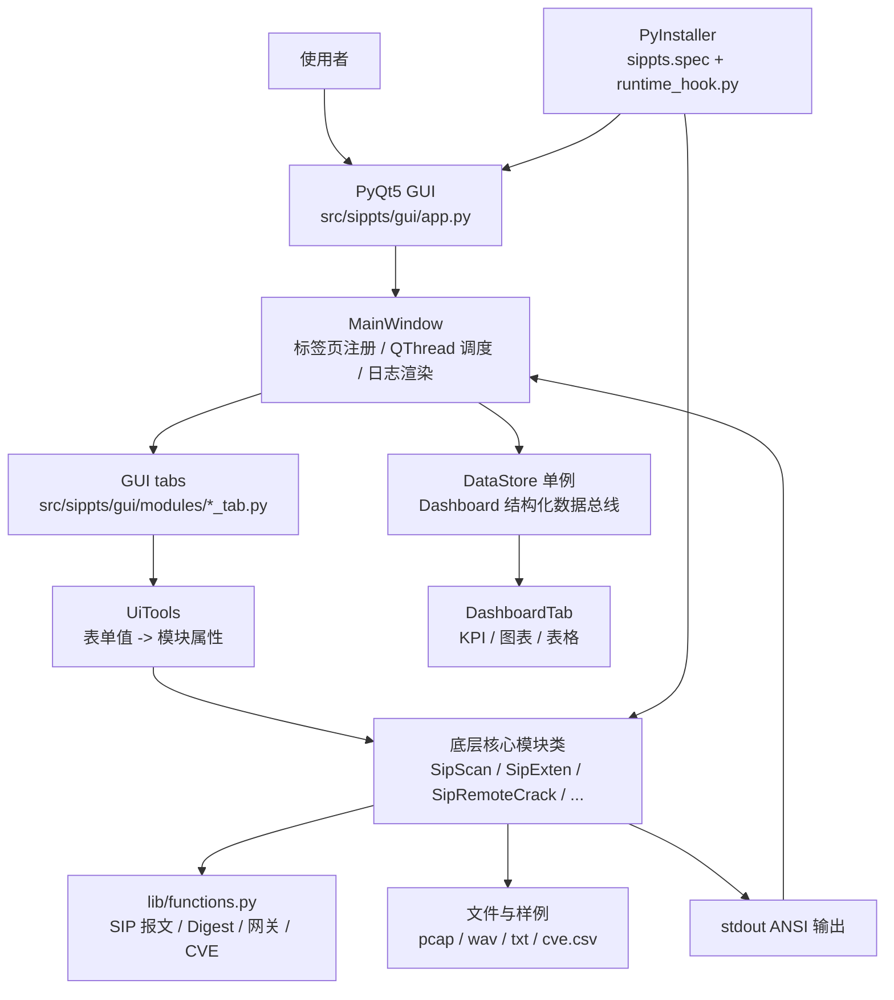
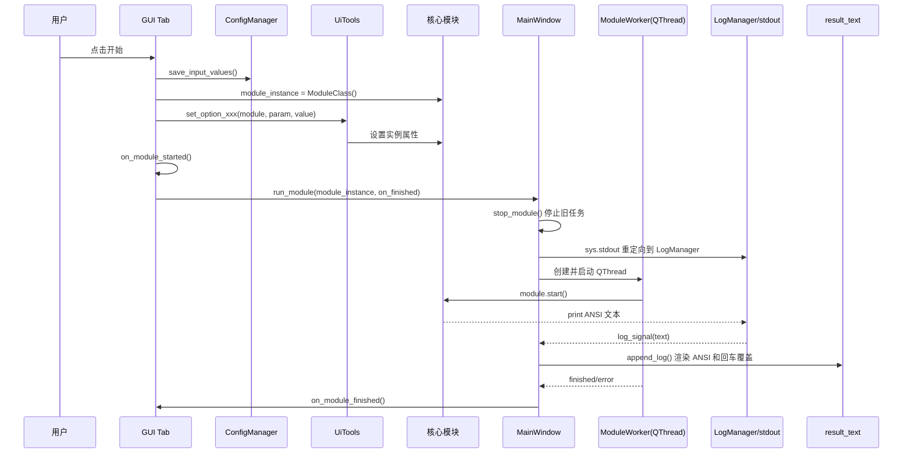
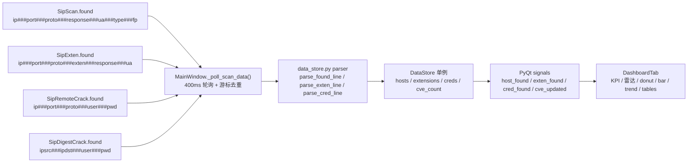
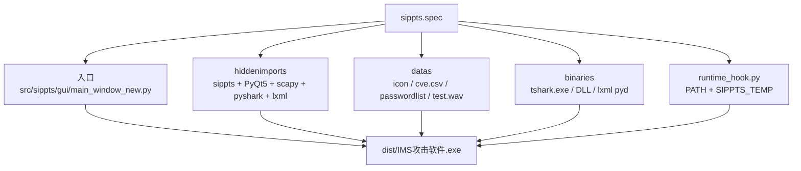
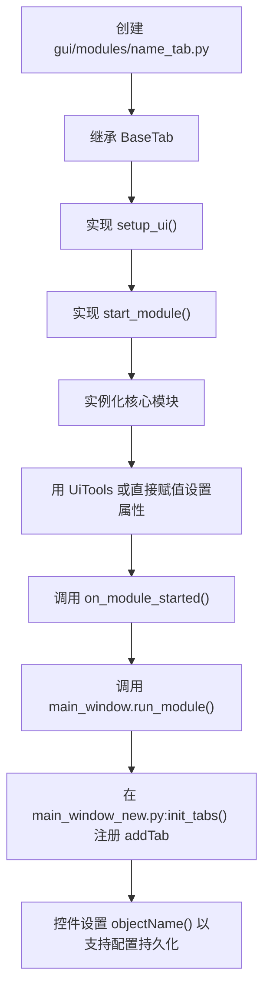

# IMS攻击测试软件 工程交接说明

本文档用于工程交接，目标读者是第一次接手本仓库、并且主要通过桌面 UI 使用和维护工具的同事。阅读顺序建议为：先看“工程定位”和“总体架构”，再看“GUI 架构与数据流”，最后重点阅读“功能使用场景与使用方法”和“常见维护任务”。

> 合规提醒：本工程包含 SIP/VoIP 安全测试、ARP 欺骗、RTP 注入/劫持等能力，只能在已授权的测试环境中使用。不要在生产网络或未授权目标上运行扫描、破解、欺骗、嗅探、洪泛等模块。

## 1. 工程定位

本仓库是上游 [Pepelux/sippts](https://github.com/Pepelux/sippts) 的一个 fork。上游项目是一个基于 Python 的 SIP/VoIP 安全审计工具集，当前 fork 的核心目标是把这些能力封装成中文本地化的 PyQt5 桌面 GUI，方便在 IMS/SIP 测试场景中通过图形界面操作。

当前 fork 的主要变化：

- 增加了中文本地化的 PyQt5 桌面 GUI。
- GUI 直接复用底层 SIPPTS 核心模块，不通过 shell 拉起命令。
- 增加了 HUD 暗蓝安全控制台主题和总览 Dashboard。
- 增加了 `rtphijack` RTP 劫持模块。
- 扩展了 `arpspoof` ARP 欺骗模块，包含网关检测、ARP 表维护、防御线程、IP 转发启停等逻辑。
- 支持 PyInstaller 打包成 Windows 可执行文件，输出名为 `IMS攻击软件`。

仓库没有自动化测试、lint 或 CI。根目录下的 `.pcap`、`.wav`、`.txt`、`.pcmu` 等文件多为手工测试样例或模块运行产物。

## 2. 目录导览

```text
.
├── bin/                    # 历史命令行入口；日常交接按 GUI 使用为主
├── src/sippts/
│   ├── *.py                # 底层核心模块，每个功能通常对应一个类
│   ├── lib/
│   │   ├── functions.py    # SIP 报文、Digest、网关/IP、CVE 等通用函数
│   │   ├── color.py        # ANSI 颜色定义
│   │   ├── logos.py        # banner/logo
│   │   ├── params.py       # 历史命令行参数解析；GUI 日常维护通常不改这里
│   │   └── videos.py       # 动画帮助
│   ├── data/
│   │   └── cve.csv         # 设备指纹/CVE 数据
│   └── gui/
│       ├── app.py          # GUI 正常入口，加载 main_window_new.MainWindow
│       ├── main_window_new.py
│       ├── theme.py        # 全局 HUD 暗色主题
│       ├── uitools.py      # GUI 表单值到核心模块属性的映射
│       ├── common/
│       │   ├── base_tab.py
│       │   ├── config_manager.py
│       │   ├── data_store.py
│       │   └── file_utils.py
│       └── modules/        # 每个 GUI 标签页一个模块文件
├── docs/
│   ├── engineering-handoff.md  # 本文档
│   ├── ui-demo.html
│   ├── ui-prototype.html
│   └── interview-guide.md
├── handoff/
│   ├── build_offline_package.ps1
│   └── templates/          # 给交接/离线使用的批处理模板
├── setup.py                # 实际安装依赖来源
├── pyproject.toml          # 仍引用不存在的 requirements.txt，不能当作真实依赖来源
├── sippts.spec             # Windows PyInstaller 打包配置
└── runtime_hook.py         # PyInstaller 运行时 hook
```

注意：`src/sippts/gui/README.md` 当前显示为乱码，像是历史编码问题。维护时优先参考本交接文档、`AGENTS.md`、源码和 `docs/ui-prototype.html`。

## 3. 总体架构



最重要的设计点：GUI 没有重新实现 SIP 逻辑，而是直接实例化底层核心模块类，给对象设置属性，再调用 `start()`。这使功能逻辑复用度很高，但也意味着核心模块的 stdout 输出、`found` 列表、`stop()` 行为会直接影响 GUI。

## 4. 运行入口

### 4.1 安装依赖

推荐在虚拟环境中安装：

```bash
pip3 install .
```

真实依赖来自 `setup.py` 的 `install_requires`：

- `netifaces`
- `requests`
- `IPy`
- `scapy`
- `pyshark`
- `websocket-client`
- `rel`
- `resource`
- `PyQt5`
- `PyQtChart`

`pyshark` 需要系统上存在 `tshark`。Windows 上通常来自 Wireshark 安装目录。`pyproject.toml` 里仍配置了 `dependencies = {file = ["requirements.txt"]}`，但仓库没有 `requirements.txt`，所以不要把 `pyproject.toml` 当作依赖真相。

### 4.2 启动 GUI

源码方式运行：

```bash
cd src/sippts/gui
python3 app.py
```

`app.py` 中的 `run_gui()` 会创建 `QApplication`，应用 `theme.apply_theme(app)`，再加载 `main_window_new.py:MainWindow`。Windows 交付时通常使用 PyInstaller 打包后的 exe，打包说明见“打包说明”。

## 5. 核心模块约定

`src/sippts/*.py` 下的核心模块基本遵循同一模式：

```python
from sippts.sipscan import SipScan

s = SipScan()
s.ip = "192.168.0.0/24"
s.rport = "5060"
s.proto = "UDP"
s.threads = "200"
s.start()

# GUI 停止时会调用
s.stop()
```

维护契约：

- 模块类通常无参实例化。
- 参数不是通过构造函数传入，而是运行前给实例设置属性。
- `start()` 执行实际逻辑。
- 可中止模块需要实现 `stop()`，GUI 停止按钮会调用它。
- 模块直接 `print()` 到 stdout，通常包含 ANSI 颜色。
- 多数扫描/破解类内部使用线程或 `ThreadPoolExecutor`。
- 部分模块会把结构化结果追加到 `self.found`，Dashboard 依赖这个列表。

核心模块常见依赖：

- SIP 报文构造、解析、Digest 计算：`src/sippts/lib/functions.py`
- 颜色输出：`src/sippts/lib/color.py`
- banner/logo：`src/sippts/lib/logos.py`
- CVE 数据：`src/sippts/data/cve.csv`
- 网络包处理：`scapy`
- PCAP 处理：`pyshark` 和 `tshark`

## 6. GUI 架构

GUI 入口为 `src/sippts/gui/app.py`，实际主窗口为 `src/sippts/gui/main_window_new.py:MainWindow`。`main_window.py` 是旧版窗口实现，当前维护优先看 `main_window_new.py`。

### 6.1 GUI 标签页

`MainWindow.init_tabs()` 当前注册的标签页：

| 标签名 | Tab 类 | 核心模块 |
| --- | --- | --- |
| 总览 | `DashboardTab` | `DataStore` 聚合数据 |
| SIP扫描 | `ScanTab` | `SipScan` |
| 分机枚举 | `ExtenTab` | `SipExten` |
| 密码破解 | `CrackTab` | `SipRemoteCrack` |
| 数据分析 | `DumpTab` | `SipDump` |
| 压力测试 | `FloodTab` | `SipFlood` |
| Digest泄露 | `LeakTab` | `SipDigestLeak` |
| 离线破解 | `DCrackTab` | `SipDigestCrack` |
| 消息伪造 | `SendTab` | `SipSend` |
| SIP嗅探 | `SniffTab` | `SipSniffWrapper` |
| RTP Bleed | `RTPBleedTab` | `RTPBleed` |
| RTP注入 | `RTPBleedInjectTab` | `RTPBleedInject` |
| RTP劫持 | `RTPHijackTab` | `RTPHijack` |
| ARP欺骗 | `ArpSpoofTab` | `ArpSpoof` |

如果把“总览”也算作标签页，实际是 14 个；如果只算功能测试模块，不含 Dashboard，则是 13 个。

### 6.2 Tab 基类

所有普通功能页继承 `src/sippts/gui/common/base_tab.py:BaseTab`。

维护契约：

- 子类实现 `setup_ui()`。
- 子类实现 `start_module()`。
- 子类应设置 `self.module_instance`。
- 子类应暴露 `self.start_btn`、`self.stop_btn`，主窗口会统一设置按钮主题角色。
- 子类用 `create_result_text()` 创建终端输出区域，该控件 `objectName` 为 `termOutput`，主题 QSS 会命中它。
- 需要持久化的输入控件必须设置 `objectName()`。

### 6.3 GUI 模块运行时序



`MainWindow.run_module()` 做了几件关键事情：

- 如果已有模块在运行，先调用 `stop_module()`。
- 当前 tab 如果有 `result_text`，调用 `setup_logging()` 把 stdout 重定向到 `LogManager`。
- 创建 `ModuleWorker(QThread)`，在线程中执行 `module.start()`。
- 连接 `finished`、`error` 信号。
- 对受监控模块启动 Dashboard 数据轮询。

`MainWindow.stop_module()` 会：

- 找到当前活动 tab。
- 如果 tab 有 `module_instance.stop()`，先调用 `stop()`。
- 终止 worker 线程。
- 停止 Dashboard 轮询。
- 调用 tab 的 `on_module_stopped()`。

## 7. GUI 日志渲染

核心模块直接打印 ANSI 颜色文本，GUI 不改核心模块，而是在主窗口里模拟终端。

关键点在 `main_window_new.py`：

- `setup_logging(text_widget)` 设置 stdout 重定向。
- `init_color_map()` 建立 ANSI 颜色到 `QTextCharFormat` 的映射。
- `_insert_ansi(cursor, text)` 将 ANSI escape sequence 转成 Qt 富文本格式。
- `append_log(text_widget, text)` 处理 `\r` 和 `\n`。

不要破坏 `append_log()` 的回车覆盖逻辑。很多核心模块用类似 `print(..., end="\r")` 的方式刷新进度，且 Python/Qt 可能把正文和 `\r` 分成两次 write。如果没有跨调用的覆盖标记，GUI 会把每个进度 tick 都显示成新行。

`BaseTab.create_result_text()` 把输出区设置为 `QTextEdit.NoWrap`，用于避免 ASCII 表格和空格填充的进度行自动折行。

## 8. Dashboard 数据流

Dashboard 不修改核心模块，而是通过轮询运行中模块的 `found` 列表获取结构化结果。



`MainWindow.MONITORED` 当前配置：

| 核心类名 | Dashboard kind | 启动时清空范围 | 行为 |
| --- | --- | --- | --- |
| `SipScan` | `scan` | `hosts` | 新一轮扫描替换旧主机结果 |
| `SipExten` | `exten` | `extensions` | 新一轮枚举替换旧分机结果 |
| `SipRemoteCrack` | `rcrack` | `None` | 凭证累计，按 `ip:user` 去重 |
| `SipDigestCrack` | `dcrack` | `None` | 凭证累计，按 `ip:user` 去重 |

`DataStore` 是 `QObject` 单例。它保存 `hosts`、`extensions`、`creds`、`cve_count` 和去重集合。它发出的信号包括 `host_found`、`exten_found`、`cred_found`、`cve_updated`、`scan_started`、`scan_finished`、`cleared`。

关键坑位：`DataStore.__init__` 必须保持 no-op。真正初始化在 `__new__` 中完成。若每次 `DataStore()` 都重新执行 `QObject.__init__`，已建立的 signal 连接会被静默破坏。

## 9. 配置持久化

GUI 配置由 `src/sippts/gui/common/config_manager.py:ConfigManager` 管理，持久化文件为：

```text
src/sippts/gui/gui_config.json
```

工作方式：

1. `BaseTab.save_input_values()` 遍历当前 tab 内的 `QLineEdit`、`QComboBox`、`QCheckBox`。
2. 只有设置了 `objectName()` 的控件才会被保存。
3. 保存 key 是 tab 类名，例如 `ScanTab`、`ExtenTab`。
4. `BaseTab.load_input_values()` 按相同 key 恢复控件值。
5. 主窗口关闭时调用 `save_all_tab_configurations()` 统一保存。

新增输入控件时，如果希望自动保存/恢复，必须设置稳定的 `objectName()`：

```python
self.ip_input = QLineEdit()
self.ip_input.setObjectName("ip_input")
```

## 10. 主题和 UI

全局主题在 `src/sippts/gui/theme.py`：

- 颜色常量：`ACCENT`、`BG`、`PANEL`、`TERM_FG` 等。
- 全局 QSS：`APP_QSS`。
- 应用函数：`apply_theme(app)`。

主题在两个入口都应用：

- `src/sippts/gui/app.py:run_gui()`
- `src/sippts/gui/main_window_new.py:run_gui()`

重要 objectName：

- `primaryBtn`：开始按钮，由 `MainWindow._apply_button_roles()` 集中设置。
- `dangerBtn`：停止按钮，由 `MainWindow._apply_button_roles()` 集中设置。
- `termOutput`：终端输出区。
- `hudHeader` / `hudLogo` / `hudTitle` / `hudClock`：顶部 HUD。
- `card` / `cardTitle` / `kpiNum`：Dashboard 卡片。

Dashboard 使用 QtCharts，图表样式多数通过代码设置，因为 QtChart 不完全吃 QSS。维护图表时注意：`QLineSeries` 如果作为 `QAreaSeries` 边界，会被 area series 接管所有权，不要再单独 `addSeries()` 同一个 line series，否则可能导致崩溃。

## 11. 功能使用场景与使用方法

本章按 GUI 标签页说明每个功能什么时候用、怎么用、看什么结果，以及容易踩的坑。所有主动探测、破解、欺骗、洪泛、注入类功能都必须先确认授权范围。

### 11.1 总览

使用场景：

- 扫描、分机枚举、密码破解或离线破解运行时，需要统一看资产、分机、凭证和风险概况。
- 交接演示时，用它向同事说明各模块运行后如何沉淀结构化结果。
- 长时间跑扫描时，用它观察趋势、协议分布、响应码分布和发现列表。

如何使用：

1. 启动 GUI 后默认可看到“总览”标签。
2. 切换到“SIP扫描”“分机枚举”“密码破解”或“离线破解”并运行任务。
3. 回到“总览”，观察 KPI 卡片、协议 donut、响应码柱状图、趋势线、主机表和发现表。
4. 新一轮扫描会替换主机结果；新一轮分机枚举会替换分机结果；破解类凭证会累计去重。

结果怎么看：

- “主机”代表 `SipScan` 发现的 SIP 服务。
- “分机”代表 `SipExten` 枚举到的 extension。
- “凭证”代表远程破解或离线破解得到的用户名/密码。
- “漏洞”来自扫描时的 CVE 指纹匹配结果。

注意事项：

- Dashboard 只监控四类模块：`SipScan`、`SipExten`、`SipRemoteCrack`、`SipDigestCrack`。
- 其他模块即使有日志输出，也不会自动进入 Dashboard。
- 如果图表不更新，优先检查运行模块是否在 `MainWindow.MONITORED` 中，以及 `found` 行格式是否符合 parser。

### 11.2 SIP扫描

使用场景：

- 先摸清一个网段或单个主机上是否开放 SIP 服务。
- 识别 SIP 服务使用 UDP、TCP 还是 TLS。
- 通过响应头、User-Agent、fingerprint 和 CVE 数据做初步资产识别。
- 为后续分机枚举、密码测试、消息伪造提供目标 IP、端口和协议。

如何使用：

1. 打开“SIP扫描”标签。
2. 在目标地址输入单个 IP、域名或网段，例如 `192.168.0.0/24`。
3. 端口通常先填 `5060`；如果不确定，可填范围，例如 `5060-5080`。
4. 协议先选 `UDP`；需要完整排查时选 `ALL` 或逐个测试 UDP/TCP/TLS。
5. 根据需要填写代理、SIP domain、Contact domain、From/To 用户、User-Agent。
6. 大网段扫描时适当调高线程数，小环境或不稳定网络先用较低线程数。
7. 如需资产识别，开启指纹或 CVE 相关选项。
8. 点击“开始”，在下方终端区域观察实时进度和结果。
9. 如需保存结果，填写输出文件或输出 IP 文件。

结果怎么看：

- 看到 `200`、`401`、`407` 等响应，说明目标有 SIP 服务响应。
- `401/407` 通常表示服务存在且需要认证。
- User-Agent 和 fingerprint 可用于判断设备或软交换类型。
- 结果会进入 Dashboard 的主机表和协议/响应码统计。

注意事项：

- 大范围扫描容易产生明显网络流量，必须确认授权窗口。
- TLS 结果依赖目标证书和网络连通性，失败不一定代表端口关闭。
- 如果 UI 一直刷进度但没有结果，先缩小 IP/端口范围验证目标是否可达。

### 11.3 分机枚举

使用场景：

- 已知 SIP 服务器地址后，判断有哪些分机号存在。
- 区分不存在分机、存在但需认证、存在且可能未认证的分机。
- 为密码破解和呼叫测试准备用户名或分机号范围。

如何使用：

1. 打开“分机枚举”标签。
2. 填写目标 IP、端口和协议，通常来自 SIP 扫描结果。
3. 在分机范围中填写单个号码、范围或前缀组合，例如 `100-200`。
4. 选择探测方法，常用 `REGISTER`、`OPTIONS` 或 `INVITE`。
5. 填写 domain、Contact domain、From user、User-Agent 等 SIP 头字段。
6. 如只关心特定响应码，可填写过滤条件。
7. 点击“开始”，查看终端输出和 Dashboard 的分机表。
8. 如需交付给后续分析，填写输出文件。

结果怎么看：

- `200` 常表示请求被接受，但要结合方法判断含义。
- `401/407` 常表示分机存在或服务要求认证。
- `403/404` 常表示被拒绝或不存在，但不同厂商行为可能不同。
- Dashboard 会把分机结果和主机结果一起用于协议和响应码聚合。

注意事项：

- 分机枚举非常依赖目标 PBX 的响应策略，不能只看一个响应码下结论。
- 范围不要盲目拉太大；先用小范围确认响应模式。
- 如果目标做了限速或封禁，线程数要降下来。

### 11.4 密码破解

使用场景：

- 已确认目标 SIP 服务和分机号后，验证弱口令风险。
- 使用授权的密码字典测试 REGISTER 认证强度。
- 对已知账号或分机范围做批量认证测试。

如何使用：

1. 打开“密码破解”标签。
2. 填写目标 IP、端口、协议和分机号或分机范围。
3. 如认证用户名不同于分机号，填写认证用户名。
4. 选择或输入密码字典文件。
5. 填写 domain、Contact domain、User-Agent、前缀、分机长度等选项。
6. 设置线程数和超时时间；第一次测试建议保守设置。
7. 点击“开始”，在日志中观察尝试进度和成功凭证。
8. 成功凭证会进入 Dashboard 的凭证列表。

结果怎么看：

- 成功结果通常包含 IP、端口、协议、用户和密码。
- 如果全部失败，不代表不存在弱口令，可能是认证用户名不一致、domain 不对、协议不对或目标限速。
- Dashboard 凭证按 `ip:user` 去重，所以同一用户后续重复发现不会反复增长。

注意事项：

- 这是主动认证测试，必须有明确授权。
- 密码字典越大，运行时间和目标压力越高。
- 失败次数过多可能触发账号锁定、安全告警或封禁。

### 11.5 离线破解

使用场景：

- 已从 PCAP 或日志中提取到 SIP Digest 认证数据。
- 不希望继续对目标发认证请求，只在本地验证密码强度。
- 配合“数据分析”模块形成“提取认证数据 -> 离线破解”的流程。

如何使用：

1. 打开“离线破解”标签。
2. 输入包含 SIP Digest 数据的文件路径。
3. 选择密码字典，或启用暴力枚举模式。
4. 如只破解某个用户，填写用户名过滤。
5. 暴力模式下设置字符集、最小长度、最大长度、前缀和后缀。
6. 设置线程数。
7. 点击“开始”，查看破解进度和结果。
8. 成功结果会进入 Dashboard 的凭证列表。

结果怎么看：

- 成功结果包含源 IP、目的 IP、用户名和密码。
- 如果提示没有可解析的 Digest，先回到“数据分析”确认输入文件格式。
- 如果运行很慢，优先缩小字典或降低暴力枚举空间。

注意事项：

- 离线破解不直接打目标，但仍涉及敏感凭证，输出文件要妥善保管。
- 暴力枚举可能非常耗时，优先使用有针对性的字典。
- 输入数据质量决定破解成功率。

### 11.6 数据分析

使用场景：

- 从 PCAP 或抓包结果中提取 SIP Digest 认证字段。
- 给“离线破解”准备输入文件。
- 对样例 `snifftest.pcap`、`sipdump.txt` 等文件做离线演示，不触碰真实网络。

如何使用：

1. 打开“数据分析”标签。
2. 选择输入文件，通常是 PCAP 或包含 SIP 认证数据的文本。
3. 选择输出文件路径。
4. 点击“开始”。
5. 在日志中确认提取到的认证条目数量。
6. 将输出文件作为“离线破解”的输入。

结果怎么看：

- 输出中应包含后续 Digest 计算需要的 username、realm、nonce、uri、response 等字段。
- 如果没有提取结果，检查 PCAP 是否真的包含 SIP 认证报文。
- 如果 `pyshark` 报错，检查 `tshark` 是否安装并在 PATH 中。

注意事项：

- 这是最适合作为新同事上手演示的模块之一，因为可以用离线样例文件。
- PCAP 可能包含敏感号码、IP、认证信息，交接时不要随意外发。

### 11.7 压力测试

使用场景：

- 在授权压测窗口内验证 SIP 服务对高频请求的承受能力。
- 模拟大量 OPTIONS、REGISTER 或 INVITE 请求。
- 验证限速、防护、日志告警和服务稳定性。

如何使用：

1. 打开“压力测试”标签。
2. 填写目标 IP、端口、协议和请求方法。
3. 设置 domain、From/To、User-Agent、认证摘要或错误摘要等参数。
4. 设置请求数量、线程数、随机字符长度等压测参数。
5. 和网络/运维确认压测窗口、目标范围和回滚方案。
6. 点击“开始”，观察实时日志和目标侧监控。
7. 需要停止时点击“停止”，不要直接关闭程序。

结果怎么看：

- GUI 日志主要显示发送进度和模块状态。
- 真正的压测结论需要结合目标服务器 CPU、内存、SIP 响应时间、丢包、告警日志判断。
- 如果响应明显变慢或服务异常，应立即停止。

注意事项：

- 这是高风险模块，不适合随手演示。
- 不要对生产 IMS/PBX 直接运行。
- 压测参数先小后大，逐步增加。

### 11.8 Digest泄露

使用场景：

- 验证目标是否存在 SIP Digest Leak 相关弱点。
- 尝试诱导或捕获认证挑战/响应，用于后续分析。
- 验证设备或软交换在特定 SIP 消息下的认证处理是否安全。

如何使用：

1. 打开“Digest泄露”标签。
2. 填写目标 IP、端口、协议或输入文件。
3. 根据测试方案填写 From、To、domain、Contact domain、User-Agent。
4. 如果需要认证模式，填写用户名、密码或认证选项。
5. 设置本地 IP、spoof IP、输出文件和日志文件。
6. 点击“开始”，观察是否捕获到 Digest 相关信息。
7. 将捕获结果交给“离线破解”或人工分析。

结果怎么看：

- 重点看是否输出 Digest challenge/response 或可用于离线破解的字段。
- 没有结果可能是目标不受影响、网络不可达、协议不匹配或本地抓包权限不足。

注意事项：

- 该模块涉及报文发送和响应捕获，测试前要确认本机 IP、路由和权限。
- 如果使用 spoof IP，需要管理员/root 权限和网络环境支持。

### 11.9 消息伪造

使用场景：

- 构造自定义 SIP OPTIONS、REGISTER、INVITE、BYE、MESSAGE 等报文。
- 验证目标对特定 SIP 头、认证字段、SDP、SDES 的处理。
- 复现某个 SIP 报文问题，或按测试用例发送固定模板。

如何使用：

1. 打开“消息伪造”标签。
2. 填写目标 IP、远端端口、本地端口、本地 IP 和协议。
3. 选择 SIP 方法。
4. 填写 domain、Contact domain、From、To、tag、Call-ID、CSeq、User-Agent。
5. 如需认证，填写认证用户名和密码。
6. 如需完全自定义报文，选择模板文件。
7. 根据需要开启 SDP、SDES、No Contact、详细输出等选项。
8. 点击“开始”，观察目标响应。

结果怎么看：

- 关注响应码、响应头和是否超时。
- `401/407` 表示认证挑战，`200` 表示请求被接受，`403/404/488` 等要结合方法判断。
- 如写了输出文件，可用于后续复现和归档。

注意事项：

- 这是排障和复现很好用的模块，但报文字段必须严谨。
- 如果目标无响应，先用“SIP扫描”确认 IP、端口、协议。
- 自定义模板可能覆盖 UI 字段，维护时要看 `SipSend` 的实际优先级。

### 11.10 SIP嗅探

使用场景：

- 在授权网络中抓取 SIP 流量，观察注册、呼叫、认证、响应码。
- 生成 PCAP 或文本输出，供“数据分析”“离线破解”使用。
- 排查 GUI 发送的报文是否符合预期。

如何使用：

1. 打开“SIP嗅探”标签。
2. 点击刷新接口，选择正确网卡。
3. 设置输出文件、协议和认证过滤选项。
4. 点击“开始”，让目标设备或测试脚本产生 SIP 流量。
5. 观察日志中捕获到的 SIP 消息。
6. 需要结束时点击“停止”。

结果怎么看：

- 重点看 From/To、Call-ID、CSeq、Via、Contact、Authorization、响应码。
- 如果后续要离线破解，要确认捕获到了 Digest Authorization 或 Proxy-Authorization。
- 输出文件可交给“数据分析”继续处理。

注意事项：

- 依赖 `tshark` 和抓包权限。
- Windows 上可能需要以管理员身份运行。
- 选择错误网卡会导致没有数据。

### 11.11 RTP Bleed

使用场景：

- 检测目标 RTP 端口范围是否存在 RTPBleed 暴露。
- 在 SIP 信令之外验证 RTP 端口对特定 payload 的响应。
- 为 RTP 注入或劫持类测试确认端口范围。

如何使用：

1. 打开“RTP Bleed”标签。
2. 填写目标 IP。
3. 设置起始 RTP 端口和结束 RTP 端口。
4. 选择 payload 类型、循环次数和延迟。
5. 如需记录结果，填写输出文件。
6. 点击“开始”，观察日志中哪些端口有响应。

结果怎么看：

- 关注哪些 RTP 端口返回数据或表现异常。
- 如果没有结果，可能是端口关闭、防火墙阻断、payload 不匹配或目标不受影响。

注意事项：

- RTP 端口范围通常较大，不要一开始扫过宽范围。
- 该测试会向目标发送 RTP 数据包，必须确认授权。

### 11.12 RTP注入

使用场景：

- 在授权环境中验证目标 RTP 会话是否可能被注入音频。
- 使用 WAV 文件向指定 RTP 端口发送媒体流。
- 配合 RTP Bleed 或 SIP 会话信息测试媒体面安全性。

如何使用：

1. 打开“RTP注入”标签。
2. 填写目标 IP 和 RTP 端口。
3. 选择 payload 类型，常见为 PCMU 或 PCMA。
4. 选择 WAV 音频文件。
5. 根据测试需要选择是否循环、是否强制发送、是否使用 spoof IP。
6. 点击“开始”，观察发送日志和目标侧媒体表现。
7. 结束时点击“停止”。

结果怎么看：

- GUI 主要显示发送状态和异常。
- 实际是否注入成功，需要在目标侧听音、抓包或查看 RTP 流确认。

注意事项：

- WAV 格式、采样率和 payload 类型不匹配会影响效果。
- spoof IP 需要管理员/root 权限和网络支持。
- 不要在真实通话中做未授权注入。

### 11.13 RTP劫持

使用场景：

- 在授权实验环境中验证 RTP 媒体流是否可能被劫持、捕获或替换。
- 捕获 RTP 音频并保存为 WAV。
- 测试 PCMU/PCMA 与 PCM/WAV 转换、实时播放或麦克风注入。

如何使用：

1. 打开“RTP劫持”标签。
2. 填写目标 IP、SIP 端口、协议、From/To 用户和 domain。
3. 设置 RTP 本地端口、payload type、超时时间和本地 IP。
4. 如需保存捕获音频，填写音频文件路径。
5. 如需实时播放，确认已安装 PyAudio 并启用播放选项。
6. 如需麦克风采集，确认麦克风权限和 PyAudio 可用。
7. 点击“开始”，观察 SIP/RTP 日志。
8. 点击“停止”后检查音频文件和日志。

结果怎么看：

- 看是否成功建立或影响目标媒体流。
- 看是否捕获到 RTP 包，以及是否写出 WAV。
- 如果实时播放无声，先确认 payload type、采样率、PyAudio 和声卡设备。

注意事项：

- 这是高风险模块，需要隔离实验环境。
- PyAudio 是可选依赖，未安装时实时播放和麦克风采集不可用。
- 源码底部有一些本地测试路径注释，维护时不要把个人路径写进正式逻辑。

### 11.14 ARP欺骗

使用场景：

- 在授权局域网实验环境中验证 ARP 欺骗风险。
- 让目标和网关之间的流量经过本机，以配合嗅探或中间人测试。
- 验证本机 IP 转发、ARP 表恢复和防御逻辑。

如何使用：

1. 以管理员/root 权限启动 GUI。
2. 打开“ARP欺骗”标签。
3. 选择或刷新网络接口。
4. 获取默认网关，确认本机 IP、网关 IP、目标 IP 在同一网段。
5. 输入单个目标 IP，或选择目标 IP 列表文件。
6. 设置详细输出级别。
7. 点击“开始”，观察 MAC 获取、IP 转发启用、ARP 欺骗启动日志。
8. 测试结束必须点击“停止”，等待恢复目标和网关 ARP 表。

结果怎么看：

- 启动日志会显示目标 MAC、网关 MAC、IP 转发状态和每个目标的欺骗线程。
- 停止日志应显示恢复目标 ARP 表、恢复网关 ARP 表、禁用 IP 转发。
- 若目标断网或本机网络异常，立即停止并手工检查 ARP 表。

注意事项：

- 这是最高风险模块之一，可能影响局域网通信。
- 必须确认目标和网关地址，避免误伤非测试设备。
- Windows 上需要管理员权限，且安全软件可能拦截 ARP/转发操作。
- 异常退出后可能需要手工清理 ARP 缓存或重启网络适配器。

## 12. 打包说明

Windows 打包入口：

```bash
pyinstaller sippts.spec
```

`sippts.spec` 做的主要事情：

- 入口脚本使用 `src/sippts/gui/main_window_new.py`。
- 收集 `sippts` 子模块。
- 收集 PyQt5 Core/Gui/Widgets/QtChart。
- 显式加入 `netifaces`、`pyshark`、`scapy`、`lxml` 等隐藏导入。
- 排除不需要或易冲突的模块，例如 `matplotlib`、`PIL`、`PyQt6`、`PySide6`、Qt WebEngine 等。
- 收集 `sippts.png`、GUI icon、`src/sippts/data`、`passwordlist.txt`、`test.wav`。
- 尝试从常见 Wireshark 安装目录加入 `tshark.exe` 和相关 DLL。
- 收集 PyQt5 翻译文件。
- 创建/使用 `temp_dlls` 保存 DLL。
- 生成 exe 名称：`IMS攻击软件`。
- `console=True`，所以打包程序运行时会带控制台窗口。

`runtime_hook.py` 做的主要事情：

- 设置 `sys._MEIPASS`。
- 把 exe 所在目录加入 `PATH`，方便找到 `tshark`。
- 创建临时目录 `%TEMP%/sippts_temp`。
- 设置环境变量 `SIPPTS_TEMP`。



## 13. 常见维护任务

### 13.1 新增 GUI 功能标签页



最小结构：

```python
from sippts.gui.common.base_tab import BaseTab

class NewTab(BaseTab):
    def __init__(self, main_window):
        super().__init__(main_window)
        self.setup_ui()
        self.load_input_values()

    def setup_ui(self):
        # 创建输入控件、start_btn、stop_btn、result_text
        pass

    def start_module(self):
        self.save_input_values()
        self.module_instance = SomeCoreModule()
        # 设置 self.module_instance 的属性
        self.on_module_started()
        self.main_window.run_module(self.module_instance, self.on_module_finished)
```

### 13.2 新模块接入 Dashboard

需要同时改三处：

1. `main_window_new.py:MONITORED`：添加核心类名到 `(kind, reset_scope)`。
2. `data_store.py`：添加解析函数或复用现有 parser，把 `found` 行转成 dict。
3. `main_window_new.py:_poll_scan_data()`：按 kind 调用 parser 和 `DataStore.add_xxx()`。

设计建议：

- 尽量让核心模块继续只维护 `self.found`，不要直接依赖 GUI。
- `found` 行格式必须稳定，建议继续使用 `###` 分隔。
- Dashboard 的去重 key 要根据业务含义选，例如主机按 `(ip, port, proto)`，分机按 `(ip, port, exten)`。

### 13.3 修改主题

优先改 `src/sippts/gui/theme.py`：

- 颜色常量统一放在文件顶部。
- 全局控件样式放在 `APP_QSS`。
- Dashboard 图表样式在 `dashboard_tab.py` 中用 `QPen`、`QBrush`、`QColor` 设置。
- 按钮角色由 `_apply_button_roles()` 自动设置，不要在每个 tab 里重复写样式。

### 13.4 更新打包依赖

如果新增第三方库或资源文件：

- Python import 相关：检查 `sippts.spec:hiddenimports` 是否需要显式加入。
- 资源文件：加入 `sippts.spec:datas`。
- DLL/exe：加入 `sippts.spec:binaries`，或扩展收集路径。
- 运行时环境变量：必要时修改 `runtime_hook.py`。
- 安装依赖：更新 `setup.py:install_requires`。

## 14. 风险和坑位

| 位置 | 风险 | 处理建议 |
| --- | --- | --- |
| `UiTools` / Tab 表单 | UI 字段和核心模块属性错位 | 每次新增字段都核对 `start_module()` 和 `set_option_xxx()` |
| `DataStore.__init__` | 重复初始化 QObject 会断开信号 | 保持 no-op，状态初始化只放 `__new__` |
| `append_log()` | 破坏 `\r` 覆盖会导致进度刷屏 | 修改日志逻辑后必须用扫描/破解进度输出手工验证 |
| QtCharts `QAreaSeries` | series 所有权重复导致崩溃 | boundary line series 被 area 接管后不要再单独 `addSeries()` |
| `src/sippts/gui/README.md` | 当前乱码 | 不以它作为维护依据 |
| `pyproject.toml` | 引用不存在的 `requirements.txt` | 依赖以 `setup.py` 为准 |
| `pyshark` | 依赖外部 `tshark` | 确认 Wireshark/tshark 在 PATH 或打包进 exe |
| ARP/RTP 模块 | 需要权限且影响网络 | 只在授权隔离环境测试 |
| 无测试套件 | 改动容易靠人工验证遗漏 | 每次改动写明手工验证步骤和样例输入 |
| stdout 重定向 | GUI 捕获依赖全局 `sys.stdout` | 长任务并发或嵌套输出时要小心 |

## 15. 建议的上手路线

第一天：

1. 读本文档第 1 到 8 节，理解 GUI 如何调用底层模块。
2. 打开 `src/sippts/gui/app.py`、`main_window_new.py`、`common/base_tab.py`、`common/data_store.py`。
3. 只运行 GUI，不碰主动攻击类功能，先熟悉标签页和配置保存。
4. 用离线样例文件演示“数据分析”和“离线破解”的输入输出关系。

第二天：

1. 选择一个简单模块，例如 `DumpTab` + `SipDump`，从 GUI 表单追踪到核心模块。
2. 再看 `ScanTab` + `SipScan`，理解 `found` 如何进入 Dashboard。
3. 看 `UiTools.set_option_scan()`，熟悉 GUI 属性注入模式。
4. 看 `sippts.spec`，理解打包资源来源。

第三天：

1. 在隔离授权环境中运行 GUI。
2. 用小范围目标测试“SIP扫描”和“分机枚举”。
3. 如需测试网络影响类模块，先确认目标、权限、网段和回滚方式。

## 16. 维护时的最小核对清单

改 GUI：

- Tab 继承 `BaseTab`。
- `setup_ui()` 创建 `start_btn`、`stop_btn`、`result_text`。
- 需要持久化的控件有 `objectName()`。
- `start_module()` 保存配置、实例化核心模块、设置属性、调用 `run_module()`。
- `main_window_new.py:init_tabs()` 已注册。

改 Dashboard：

- `MONITORED` 已配置。
- `found` 行格式有 parser。
- `DataStore` 有对应 add 方法或复用已有方法。
- Dashboard 表格、KPI、图表更新逻辑能处理新数据。

改打包：

- `setup.py` 依赖已更新。
- `sippts.spec` hiddenimports/datas/binaries 已更新。
- 本地 PyInstaller 能完成打包。
- 打包产物能启动 GUI，并能找到 icon、CVE 数据、tshark 或相关 DLL。

## 17. 快速文件索引

| 你要找什么 | 优先看哪里 |
| --- | --- |
| GUI 入口 | `src/sippts/gui/app.py` |
| 当前主窗口 | `src/sippts/gui/main_window_new.py` |
| GUI 基类 | `src/sippts/gui/common/base_tab.py` |
| GUI 参数映射 | `src/sippts/gui/uitools.py` |
| GUI 配置持久化 | `src/sippts/gui/common/config_manager.py` |
| Dashboard 数据总线 | `src/sippts/gui/common/data_store.py` |
| Dashboard UI | `src/sippts/gui/modules/dashboard_tab.py` |
| 各功能标签页 | `src/sippts/gui/modules/` |
| 主题 | `src/sippts/gui/theme.py` |
| SIP 报文/认证/CVE 工具函数 | `src/sippts/lib/functions.py` |
| 底层功能模块 | `src/sippts/*.py` |
| Windows 打包 | `sippts.spec`、`runtime_hook.py` |
| CVE 数据 | `src/sippts/data/cve.csv` |